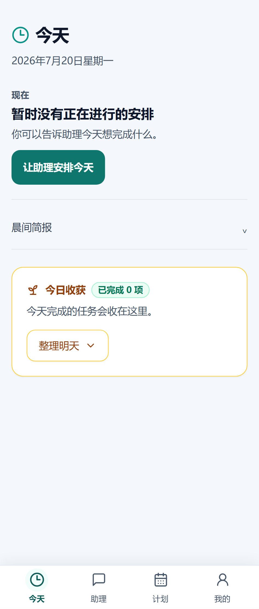
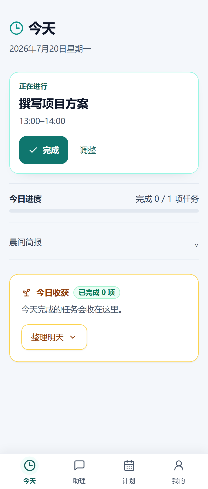
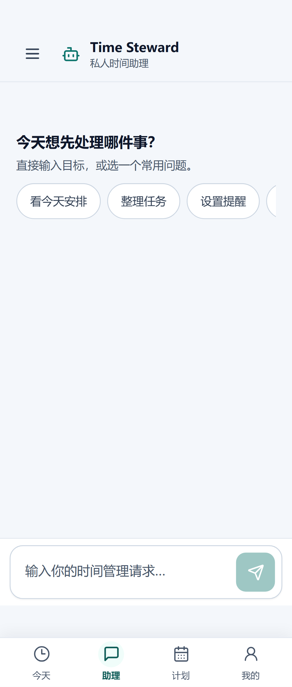
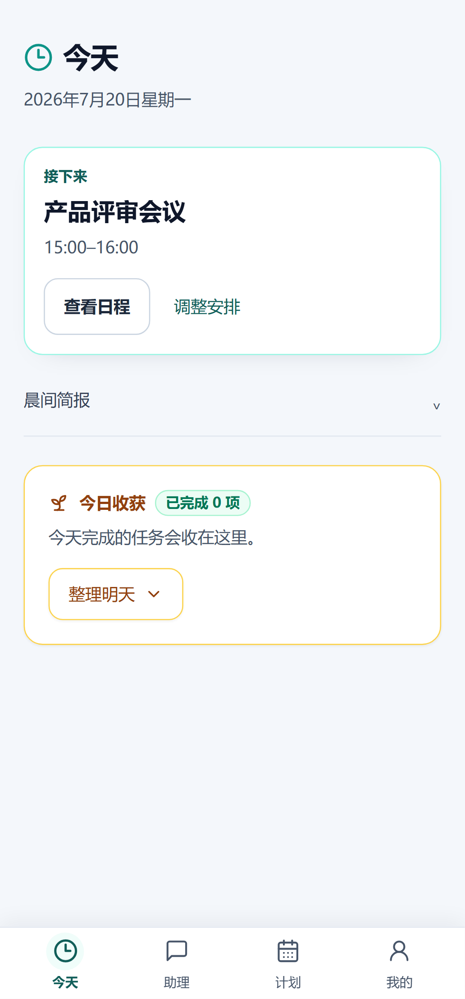

# TimeAgent Mobile UX V1 — Iterations 1–3 Report

Date: 2026-10-04
Scope: Iteration 1 (Mobile Shell / Navigation, Today, Assistant) and Iteration 2 (Plan Hub, mobile Calendar, Tasks). Day Closing receives a contrast-only correction; its flow remains unchanged.

## Initial Audit

The repository and live production baseline were checked before implementation. Local `main`, `origin/main`, and both production containers reported revision `6b794ab`; the public readiness endpoint returned HTTP 200 with database and Redis ready. No deployment was performed during this iteration.

The source audit found that the mobile navigation grouped Calendar, Tasks, Planning, and Reminders under a schedule label, while less frequent destinations were presented as large “More” cards. Today gave the morning brief, rhythm summary, statistics, and Now/Next/Later panels similar visual weight. Assistant showed a large empty-state panel, unconditionally scrolled to the newest transcript entry, and opened history without modal focus or native Back behavior. The Today summary error had no local retry. Several primary mobile controls were 44 px high, and the mobile palette compatibility rule darkened white labels even on teal buttons.

Five independent review perspectives (product design, UX, accessibility, Android WebView, and visual consistency) converged on four Iteration 1 fixes: foreground the Today action, keep Assistant conversational, stop interrupting transcript reading, and strengthen touch/contrast behavior. Iteration 2 delivered the Plan Hub, Calendar and Tasks. Iteration 3 now completes the focused Planning, Reminder, Approval, Memory and Me interactions while preserving Day Closing behavior.

## Information Architecture

| Destination | Mobile entry | Route behavior |
|---|---|---|
| Today | `今天` | `/today` |
| Assistant | `助理` | `/chat` |
| Plan | `计划` | `/schedule`; `/calendar`, `/tasks` and `/planning` also highlight Plan |
| Me | `我的` | Opens grouped drawer; reminders, insights, briefings, approvals, and settings remain inside |

The current user’s staff-only system-status route remains permission-filtered. The Me drawer uses labeled groups and full-width rows. Active navigation state includes weight, an icon background, `aria-current`, and screen-reader text; color is not the only cue.

## Design Language

The mobile palette uses a cool `#F4F7FB` canvas, white content surfaces, dark primary text, `#475569` supporting text, teal actions, and restrained amber harvest accents. At 360 CSS px and below, the page gutter is 16 px; it is 20 px above that. Core controls use 48 px targets, secondary controls use at least 44 px, sheets respect safe-area insets, and solid primary controls keep white labels.

The Today harvest card now uses a solid white background and a clear amber outline. A browser assertion checks its heading and supporting copy against the surface at the WCAG AA 4.5:1 normal-text threshold. The existing completion and tomorrow-draft behavior remains unchanged.

## Before / After

| Area | Before | After |
|---|---|---|
| Navigation | Today / Chat / Schedule / More; reminders highlighted as Schedule | Today / Assistant / Plan / Me; secondary routes grouped in Me |
| Today | Multiple equal-weight cards before the execution choice | One server-ordered current/next focus, then remaining next items, progress, and collapsed secondary content |
| Assistant empty state | Large landing-style panel with large action buttons | Short prompt and horizontally scrollable 44 px quick-action chips; composer remains primary |
| Transcript | Every entry update forced smooth scroll to bottom | Follow only while the user stays near the bottom; show “回到最新消息” while a run continues |
| History | Custom overlay without modal/focus/native Back contract | Shared Drawer with title, focus trap/restore, inert background, Escape, and native Back listener cleanup |
| Harvest contrast | Light gradient behind multiple accent colors | Solid white surface, dark copy, amber outline |

## Implemented Screens

### Mobile Shell / Navigation

- Replaced the schedule/More bar with Today, Assistant, Plan, and Me.
- Added route-aware `aria-current`; Calendar/Tasks/Planning map to Plan, while Me routes map to Me.
- Replaced the feature-card list with grouped navigation rows.
- Kept the bar fixed, compact, and safe-area aware; it becomes inert and moves away while the mobile keyboard is active.
- Updated onboarding labels to match the new navigation language.

### Today

- Uses the first item in `execution_now`; if empty, uses the first item in `execution_next`; otherwise presents one Assistant action. The browser does not recalculate time buckets.
- Shows remaining Next entries as rows, collapses Later, and moves Morning Brief below the primary action.
- Replaces the old metric triplet with a compact completion progress line when task counts exist.
- Adds a 48 px retry control for Today summary errors.
- Leaves the desktop execution surface intact and preserves Day Closing behavior.

### Assistant

- Uses a compact Time Steward header and an empty state that leads with a short prompt and horizontally scrolling quick actions.
- Keeps the composer above the virtual viewport using `visualViewport` resize/scroll events; hides bottom navigation while text entry is active.
- Makes send/stop controls 48 px. The transcript itself is not a live region; run status is announced separately.
- Stops forcing the viewport to the end when a user scrolls away during streaming.
- Presents conversation history in the shared Drawer. Conversation selection closes the Drawer and restores focus to its trigger.

### Iteration 2 — Plan Hub, Calendar and Tasks

#### Plan Hub

- The Plan tab opens `/schedule`, a mobile overview with a seven-day date rail, selected-day agenda, planned task intervals, a separate unplanned-task preview, and one primary Planning CTA.
- Calendar events and task intervals remain sourced from their existing APIs. The browser only sorts and presents them; it does not derive availability, conflicts, or approval outcomes.
- Date keys and expanded request ranges use explicit local-date/timezone helpers. Selecting a date scrolls the chip fully into view.

#### Calendar

- Mobile uses a keyboard-operable month grid as date navigation and opens the existing day agenda in the shared Drawer. Desktop retains FullCalendar month/week/day views.
- The day agenda keeps event editing, deletion confirmation, creation, timezone conversion, and API validation in existing flows.
- Narrow screens use a full-bleed month surface with contained horizontal rails; selected and actionable controls use high-contrast text.

#### Tasks

- Common task filters are visible; less-used filters, recommendations and secondary task actions are progressively disclosed.
- Task execution and completion still use existing endpoints. Dates distinguish planned time from due time; the mobile UI does not infer completion before the API responds.
- Filter controls expose selected state, action targets meet the mobile target size, and completion focus returns to the invoking task control.

#### Iteration 2 evidence

- Browser screenshot evidence covers Plan, Calendar and Tasks at 360, 375, 393, 412 and 430 CSS px, plus the Calendar day agenda at 393 px. The screenshots are under [`evidence/`](evidence/).
- The Playwright suite uses deterministic API mocks; it validates browser layout and interactions, not a production backend or real Agent run. Environment-dependent live cases are skipped when their configuration is absent.
- Visual review corrected low-contrast selected teal labels, repeated narrow-screen Calendar margins, and a selected Plan date chip that could start outside the visible rail.
- Full Playwright suite: **72 passed, 10 skipped, 0 failed** across desktop and mobile projects. The skips are project-specific or require live backend/staging configuration. The completion feedback recovery test also verified a refresh race fix: a stale pending-interaction GET can no longer overwrite the card installed by a successful retry.
- Iteration 2 automated results: Vitest **185/185 passed**; ESLint and Vite production build passed. Django system check passed. `makemigrations --check --dry-run` reported no changes, but could not verify migration-history consistency because PostgreSQL was not running locally; no backend models or migrations changed.
- No Android device was attached (`adb devices` was empty); physical WebView/IME/TalkBack checks remain **NOT EXECUTED**.

### Iteration 3 — Planning, Reminders, Approvals, Memory and Me

- Planning offers a mobile time-edit Drawer for placed, unlocked, single-segment items. Local start-time input is converted using the account timezone, edits use the current plan interaction API/version, a ±15-minute change preserves duration, and the result remains a draft. Apply continues through ActionProposal and HITL.
- Reminders use a focused create Drawer with timezone-labelled local time, existing DST validation and UTC serialization, idempotency, success status, independent error/retry controls, and separate failed/pending/history/cancelled groups.
- Approvals move status filters into a mobile Drawer, show the first three batch changes before a counted disclosure, and lock stale local edits when the proposal version changes. The user must close and reopen editing to load the current payload/version. Decisions still use the existing proposal API.
- Memory uses account/profile timezone for timestamps, plain-language proposal/reason labels with safe fallbacks, progressive disclosure for statistics, visible focus/touch targets, query retry, and the shared confirmation Drawer for clearing/forgetting.
- Me navigation closes on browser route changes. The grouped destination Drawer remains the source of truth for low-frequency routes.
- Mobile Playwright evidence is saved for the Planning editor, Approval filter, Reminder form and Memory at 360/393/430 px. Reminder layout is additionally checked at 320 px; approvals are checked at 320/360/393 px; the planning editor is checked at 320 px.
- The browser suite uses deterministic mocked API responses. It verifies interaction/API contract boundaries; it does not claim live production Agent behavior or native Android behavior.
- The mobile plan editor now exposes server rejection and stale-plan refresh messages inside the open sheet, so a conflict remains visible while the background is inert.

## Final Validation and Deployment — 2026-10-04

- Vitest: **194 passed** across 38 files.
- ESLint: passed.
- Vite production build: passed. Existing warnings remain for the 610 KB main JavaScript chunk and the Capacitor App module being both statically and dynamically imported.
- Playwright: **77 passed, 11 skipped, 0 failed** across desktop Chromium and mobile Chromium (88 collected). Skips follow the suite's project filters and missing staging/live-backend configuration. Deterministic mocked APIs cover the browser UX; this does not establish live Agent or production API behavior.
- Backend pytest: **697 passed, 3 skipped**. Ruff and mypy passed.
- Django system check passed; `makemigrations --check --dry-run` found no model changes. Production `migrate --noinput` reported no pending migrations.
- DeepSeek production release evaluation: **13/13 cases passed**.
- `git diff --check`: passed. No API schema, database, Agent, Planner, or HITL policy changes were made.
- Mobile UX V1 commit `be35eb5` and Android release commit `1ec7cf4` were pushed to `origin/main`; the latest Django and frontend images report revision `1ec7cf4`.
- Local and public `/health/ready` both returned HTTP 200 after deployment. Django, PostgreSQL, and Redis reported healthy.
- Android production APK `1.1.12` (`versionCode 16`) is published and verified against the current production signing certificate. The production update view returns matching version, SHA-256 and size; the public APK URL returns HTTP 200 with matching downloaded bytes. No physical device was connected for install and screenshot review.

### Explicitly out of scope

Full Day Closing workflow behavior remains unchanged. No API, database, Agent, Planner, or HITL business rules changed.

## Rejected Ideas

- Do not place every route in the bottom bar; keep four stable destinations and group lower-frequency routes under Me.
- Do not reproduce the desktop Now/Next/Later dashboard as equal-weight mobile cards.
- Do not let the browser infer current/next schedule state; use the existing `TodayService` buckets.
- Do not treat the Assistant empty state as a marketing landing page or auto-focus the keyboard on entry.
- Do not move schedule feasibility, conflicts, authorization or approval decisions into the frontend.
- Do not claim Android keyboard, system bar, or TalkBack behavior from a desktop browser emulator.

## Iteration 1 Mobile E2E

Playwright uses deterministic route mocks in this suite; it validates browser rendering and interaction, not the production backend or a real Agent run.

- Mobile browser suite: **18/18 passed**.
- Viewport screenshots: Today and Assistant at 360, 375, 393, 412, and 430 CSS px.
- Today states: empty, active task at 360 px, and next event at 393 px.
- Reflow: 320 px Today and Assistant pass the no-horizontal-overflow check.
- Additional assertions: active navigation, Me drawer routing, Escape close, harvest text contrast, Assistant history modal, and synthetic virtualViewport keyboard resize.
- Selected evidence is saved alongside this report under [`evidence/`](evidence/). All five widths are captured by the test.

Representative images:

## Android Validation

The Android activity now declares `windowSoftInputMode="adjustResize"`. While a Drawer is open, the shared overlay registers Capacitor `App` `backButton`, closes the overlay, and removes the listener on unmount. Unit coverage verifies close and cleanup. A browser test simulates a reduced `visualViewport` height and checks that the composer moves above the keyboard area and the bottom bar becomes inert. `:app:assembleDebug` succeeded and produced a debug APK.

`adb devices` returned an empty device list. Therefore debug APK install, physical Gboard/IME behavior, TalkBack, system bars/edge-to-edge behavior, gesture Back, and native deep links are **NOT EXECUTED**.

## Accessibility

- Navigation is labeled and route-aware; selected state is conveyed by more than color.
- Drawer dialog has a title, explicit close button, focus entry/trap/restore, inert background, Escape support, and native Back listener lifecycle.
- Bottom navigation and primary Today/Assistant controls have 48 px targets; secondary row actions and chips have at least 44 px targets.
- Today loading/error states have restrained status/alert semantics and error retry.
- Assistant status is announced separately from transcript content; streaming does not mark the entire transcript as live.
- Harvest contrast is checked in the mobile browser at 4.5:1 or greater for title and supporting copy.
- Reduced-motion preferences remain honored by the existing global stylesheet.
- Physical TalkBack review remains open because no Android device was attached.

## Known Gaps

- Browser fixtures mock API responses. Real Backend → Agent → LLM → Tool → HITL behavior was not revalidated as part of this visual/mobile iteration.
- No physical Android device was available; browser viewport checks cannot verify OEM keyboard, system bars, or TalkBack.
- The desktop workspace Playwright suite passed **7/7** when run serially during Iteration 1. The final combined desktop/mobile suite passed **77 tests**, skipped 11 project/environment-filtered cases, and had no failures. Vitest passed **194/194**; ESLint and Vite build passed.
- Physical Android installation, OEM keyboard/IME behavior, system bars, gesture Back, and TalkBack remain open because no device was attached.
- The production build succeeds. Vite still reports the existing large main chunk warning; no code-splitting work was included in the mobile UX scope.
- Browser fixtures mock API responses; they do not establish live Agent or production API behavior.

## Next Iteration

The deterministic timezone-boundary fixture passes; live account/staging validation and physical Android checks remain for an environment with the relevant backend and device. Do not expand V1 into a broad redesign without a new scope and updated Blueprint.
