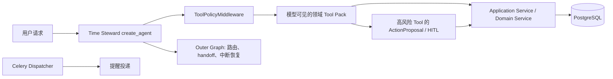

# TimeAgent Agent Harness 与工具集结构优化设计

- 日期：2026-09-26（Asia/Shanghai）
- 基线：当前工作区 Time Steward 注册表和运行时实现
- 关联方案：[LLM 增强优化方案](../evaluation/timeagent-llm-augmentation-optimization-plan-2026-09-26.md)
- 参考盘点：[工具集核实与优化讨论](./README.md)
- 状态：P0 与主要 P1 已实现并于 2026-09-27 部署到本机生产 Compose；13 项真实模型门禁通过。真实用户长期观察仍待收集

## 一、目标与结论

这轮结构优化的目标不是单纯减少工具数量，而是让模型每轮看见的能力与当前请求相关，让工具的副作用、风险、重试和批量语义可从同一处核验，并让多任务排程默认走原子计划路径。

当前注册表有 44 个唯一工具，其中 20 个只读/交接入口和 24 个写入口。主要结构问题如下：

1. `create_agent()` 固定注册全部工具，`ToolPolicyMiddleware` 主要按 `read_only` 切成“只读”或“读写全部”，没有按场景收窄领域能力。
2. `READ_ONLY_TOOLS` 不等于无副作用：`propose_schedule_plan` 持久化草案，`list_temporal_insights` 扫描并更新派生洞察。
3. 工具注册分类、HITL 风险策略、审计风险标签和重试白名单由不同列表维护，存在旧 Event 名称和不完整策略。
4. 多任务排程有可能走多次 `reschedule_task`，绕过 `SchedulePlan` 的统一校验和原子应用。
5. 列表与详情接口的结果规模、分页和摘要字段不统一；常见日程查询可能要重复读取事件、任务和提醒。

建议按顺序做：**先统一工具契约与副作用/风险治理，再固化排程写入边界，接着按请求意图分组暴露工具并优化常用读取，最后用真实轨迹决定是否合并或移除工具。** 保留 LangChain `create_agent()` 作为唯一 Time Steward Agent 循环，Outer Graph 不新增规划或路由 Agent。

## 二、当前运行结构

Time Steward 在 [`time_steward.py`](../../backend/apps/agents/agents/time_steward.py) 将 44 个 Tool 一次性注册到 `create_agent()`。[`ToolPolicyMiddleware`](../../backend/apps/agents/middleware.py) 对只读 Run 暴露 `READ_ONLY_NAMES`，对读写 Run 暴露 `READ_ONLY_NAMES | WRITE_NAMES`，Memory 工具另受功能开关控制。HITL 策略在 [`risk_policy.py`](../../backend/apps/action_proposals/risk_policy.py)，审计风险标签和重试列表又在 middleware 中独立判断。

Outer Graph 继续负责触发路由、handoff、中断恢复和确定性工作流；Tool 经 Application Service 写业务事实；提醒发送保持在 Celery Dispatcher。此方案不改变这些边界。

## 三、目标工具契约：一个清单，多处派生

增加一个有实际消费方的 Tool Manifest，作为当前注册工具治理的唯一数据源。它不是另一个业务抽象层，而是用来生成/校验现有注册数组、动态暴露策略、HITL 策略及重试列表，消除散落的重复名单。

每个已注册 Tool 至少声明：

| 元数据 | 作用 |
|---|---|
| `name`、`domain`、`purpose` | 唯一身份、领域和简洁的模型用途说明。 |
| `effect` | `read`、`derive`、`draft`、`business_write` 或 `handoff`。区分派生写入、草案持久化和业务事实变更。 |
| `tool_packs` | 可出现的请求意图组，例如 `overview`、`planning`、`tasks`。 |
| `run_modes` | 允许出现于 `read_only` / `read_write` 等可信执行模式。 |
| `approval_rule` | `never`、`always` 或按受限参数解析的规则；工具是否改事实和是否要 HITL 分开表达。 |
| `idempotency`、`retry` | 幂等键来源、是否可在失败后自动重试；默认仅对真正无副作用读取重试。 |
| `version_required`、`batch_semantics` | 是否需要 expected version、是否原子批处理及批次边界。 |
| `audit_class` | ToolAudit 的风险/副作用标签，不能从“是否在 WRITE_TOOLS”粗略推断。 |

Manifest 在启动或测试时校验：

- 每个模型可见 Tool 恰有一条契约；名称唯一；无未知风险策略和失效工具名。
- `effect=business_write` 必须说明 Service、审批规则、幂等策略及版本语义。
- `effect=draft/derive` 必须写明持久化对象和可否重放；不可自动继承只读重试策略。
- 高风险 Tool 的 HumanInTheLoopMiddleware 配置与 Manifest 一致；按参数决定审批的规则仍使用确定性 resolver。
- Handoff 单独作为控制流能力记录，不伪装成业务查询。

### 3.1 对当前工具的副作用重分类

| 现有工具 | 建议 effect | 说明 |
|---|---|---|
| `list_events`、`get_event`、`list_tasks`、`get_task`、`list_reminders`、`get_reminder`、执行摘要、日历连接状态、Memory 搜索等 | `read` | 不改变数据；分页与结果上限仍需统一。 |
| `propose_schedule_plan`、`compare_schedule_plans` | `draft` | 会创建持久化 Plan；不改任务/日历事实，但不是纯读取。检查重放键及未选草案清理。 |
| `list_temporal_insights` | `derive` | 先执行洞察扫描，再返回读取结果；结果需审计其派生写入与刷新行为。 |
| `validate_schedule_plan` | `derive` | 以最新事实校验；无效时会使草案失效，记录计划生命周期副作用。 |
| `set_schedule_plan_item_lock`、`abandon_schedule_plan` | `draft` | 改变草案状态，不直接改变 Task/Event；限制为明确目标与版本。 |
| `mutate_events`、任务状态/属性变更、提醒管理、Memory 偏好写入、反馈、洞察处置等 | `business_write` 或领域派生写 | 根据实际服务行为逐项标记；“写入”不必然等于同一风险级别。 |
| `transfer_to_briefing` | `handoff` | 受限的控制流操作，不是普通只读查询。 |

`risk_policy.py` 中遗留的 `create_event`、`create_event_batch`、`update_event`、`cancel_event` 不再是注册入口。应标成明确的内部 legacy，或移除过期策略；禁止让其进入模型可见 Manifest。

## 四、模型可见工具集设计

不以“44 太多”为理由删减业务操作。先将工具组织成可重叠的逻辑 Pack，再依据可信运行模式和评测过的路由信号限制每轮暴露。底层权限检查和 Service 校验始终有效；Pack 只减少模型选项，不构成授权。

### 4.1 目标 Pack 目录

| Pack | 主要内容 | 适用请求 | 与其他 Pack 的组合 |
|---|---|---|---|
| `overview` | `get_current_datetime`（按需）；候选新增 `get_day_overview(date)`，返回用户时区内日程、任务、截止项和提醒的短摘要 | “今天有什么安排”“我这周忙吗” | `planning`、`tasks` |
| `calendar` | `list_events`、`get_event`、`mutate_events`、`create_recurring_event` | 查询/创建/修改/取消日程 | `planning` |
| `tasks` | `list_tasks`、`get_task`、`get_task_execution_summary`、`create_task`、`create_task_batch`、`update_task`、`change_task_state`、`change_task_batch_state`、`complete_task`、`reschedule_task`、`cancel_task` | 管理单个或一组任务 | `planning` |
| `availability` | `get_planning_context(mode="free_slots")`、`get_current_datetime` | 只询问空闲时段/推荐窗口 | 使用后端冲突计算，不向模型提供任务和日历明细 |
| `planning_preview` | `get_planning_context(mode="context")`、`get_capacity_forecast`、`recommend_task_duration`、`propose_schedule_plan`、`compare_schedule_plans` | 生成多任务草案或规划比较 | 一次读取排程所需任务、日历、工作时间和规划偏好 |
| `plan_review` | `validate_schedule_plan`、`set_schedule_plan_item_lock`、`abandon_schedule_plan`、`apply_schedule_plan` | 复核、编辑或应用一个已创建的草案 | 应在该计划需要复核/应用时出现；`apply` 仍要经过 HITL |
| `plan_adaptation` | `detect_schedule_disruptions`、`list_automation_policies`、`apply_local_replan` | 调查现有安排被打断，或调整明确授权的柔性任务 | 必须能读取 `tasks` 与 `calendar` 事实；移动操作仍要审批 |
| `reminders` | `list_reminders`、`get_reminder`、`create_reminder`、`update_reminder`、`set_reminder_target`、`cancel_reminder` | 设置和管理提醒 | 目标是 Task/Event 时按需读取对应实体 |
| `time_insights` | `list_temporal_insights`、`get_temporal_insight`、`act_on_temporal_insight`、`search_time_memories`、`remember_time_preference`、`update_time_preference`、`forget_time_preference`、`record_task_duration_feedback` | 时间风险、记忆和个性化偏好 | 仅在请求相关或规划确需用户明确偏好时 |
| `integrations` | 外部日历同步状态 | 查询连接和同步问题 | 不隐含写入外部日历 |
| `briefing_handoff` | `transfer_to_briefing` | 用户明确请求生成/修改简报 | 由既有路由和 handoff 控制 |

`overview` 的聚合读工具是候选功能而非默认新增：当审计确认“今日安排”高频重复调用多个列表 Tool 后，再实现一个小而明确定义的 Application Service。避免增加能返回所有领域、所有时间范围的巨大 `get_everything` 工具。

### 4.2 各领域 Tool 的保留与改造决策

| 领域 | 目标决策 |
|---|---|
| Event | 保留两个安全、清楚的写入口 `mutate_events` 和 `create_recurring_event`；只读 `list_events` / `get_event` 按需出现。旧兼容函数不再进入 Manifest。 |
| Task | 保留单项与批量创建的差异，保留普通属性修改、生命周期迁移、完成证据和改期的差异；单任务改期加并发/幂等保护，多任务只能走 SchedulePlan。 |
| Reminder | 保留显式目标关联能力及 Celery 投递边界；暂不为减工具数合并成含糊的泛化 action。 |
| Planning | 保留 preview、review、apply、adaptation 的阶段分离；把 propose/compare 标成会持久化草案的能力；多任务应用需一次审批和一个事务。空档查询与排程事实读取共用一个模式互斥的只读入口；两种模式分别由后端计算可用时间或读取业务上下文。 |
| Decision | 将估时/容量/反馈放入 `planning` 或 `time_insights` Pack；反馈只在用户明确评价后调用。 |
| Insight / Memory | 保留独立能力及 Memory Policy；标注洞察查询内含派生扫描，不作为默认普遍可见工具。 |
| Integration | 同步状态查询仅在用户问连接状态/失败原因时出现；不将状态 Tool 扩展成任意外部访问。 |
| Handoff | `transfer_to_briefing` 单独归入 `briefing_handoff`；Briefing 用户请求直接走现有交接边界。 |

### 4.3 Pack 暴露策略

现有 `RuntimeContext` 有可信读写模式和运行信息，但没有一般聊天意图 Pack。不要用不可靠的关键词过滤器悄悄隐藏用户所需能力，也不默认增加额外的 LLM 路由调用。

自由聊天目前没有可信的意图字段，因此不能在进入 `create_agent()` 前准确知道该暴露哪一个 Pack。分阶段验证：

1. **Pack 定义阶段：** Manifest 记录各 Tool 可属于哪些 Pack；现有 `ToolPolicyMiddleware` 继续执行读写安全过滤。已知的专用入口（如只读模式、简报 Handoff）按可信触发类型暴露明确 Pack。
2. **自由聊天实验：** 先试高置信度的确定性 Pack 提示；无法确定时退回可覆盖请求的工具集合。不得用关键词规则硬性阻断必要 Tool。另行比较全量暴露、缩窄低频能力暴露和 Pack 路由方案；如果路由要增加专门的 LLM 分类调用，只有测得成功率/Token/p95 净收益后再采用。

评估“每轮实际暴露的 Schema 数/Token、选择正确率、漏掉必要 Tool 的恢复率、工具调用数、模型 Token、p95 延迟和任务成功率”。以 44 个注册名作为目录规模，不把注册数与每轮模型可见数混为一个优化目标。排程读取使用互斥的 `context` / `free_slots` 模式，不再单独注册 `find_free_slots`；空档模式只返回可用窗口，未给时长时由 Agent Tool 使用可信 Runtime 中的默认日程时长。

## 五、保留、整合和限制哪些 Tool

### 5.1 保留领域边界

- **Event 写入保留 `mutate_events` + `create_recurring_event`。** `mutate_events` 已按一个聚合、一份操作、一次 ActionProposal 表达相关日程变更。不要重新暴露旧的单项兼容 Tool，也不要把 Task/Reminder 一起塞入泛化 `execute_action`。
- **Task 的普通字段、生命周期和执行证据分开。** `update_task` 不承担状态转换；`complete_task` 保留完成时的执行信号；创建与批量创建根据审计/审批差异分别治理。
- **单任务改期和多任务排程分开。** `reschedule_task` 仅用于用户明确要求的一项任务。对多项任务统一走 `propose_schedule_plan → validate_schedule_plan → apply_schedule_plan`；通过 Agent 评测禁止把同一多任务意图拆为一串单项写入。
- **Reminder target 关联保持显式。** 不为了减少工具数把“更改时间/渠道”与“改变提醒对象”合成含义模糊的通用 Patch，除非同一 Schema 能清楚区分未提供、显式清空和关联目标变更。
- **Memory 与 Insight 保持独立的授权和副作用。** 读取洞察可能执行扫描；长期偏好改变继续经 Memory Policy 和审批，不并入一般任务编辑。

### 5.2 需要实现或强化的边界

| 项目 | 目标契约 | 首选实现方向 |
|---|---|---|
| `reschedule_task` | 带 `expected_version` 和稳定幂等标识；Service 重新校验合法时间及冲突；多任务计划不用它循环写入。 | 扩展现有 Tool + Task Application Service，不新造通用变更层。 |
| Plan 草案生命周期 | 明确 propose/compare 会持久化；同一个 Tool Call 回放不重复建草案；过期/未选择草案可被发现和收尾。 | 复用现有 ToolAudit 幂等和 SchedulePlan 状态机；必要时增加专用 proposal idempotency。 |
| `validate_schedule_plan` | 说明校验时可能使草案失效，按 `derive` 记账；应用前总是重新校验最新事实。 | 现有 Planning Service 与版本检查作为权威。 |
| 高风险规则 | 每个已注册 Tool 有显式审批决策；按操作参数动态决策仍由可信代码检查。 | Manifest 生成静态 HITL 配置，已有条件规则作小型 resolver。 |
| 自动重试 | 只重试无副作用读；草案/派生写只有在稳定幂等键可证明时才能安全重试；业务写按 Service 幂等规则。 | Retry 白名单从 Manifest 的 `effect/retry/idempotency` 推导。 |
| Tool Schema | 限制 action/status/frequency/target_type 等自由字符串；列表有 max limit / page cursor；更新时间/状态变更具备版本。 | 继续使用 typed args/Pydantic；批量 DTO 用 `extra=forbid`。 |

## 六、重要工作流的目标工具序列

### 用户询问今天安排

目标：一次 `get_day_overview(date)` 返回短摘要及下一步可查询对象 ID；只有用户追问时才调用列表或详情。该读聚合必须只读、用户隔离、时区明确、结果有硬上限。

### 用户安排多项任务

目标：选择任务 → 生成一个持久化计划草案（含容量和未安排证据）→ 最新事实校验 → 向用户展示单一可审批计划 → ActionProposal/HITL → 批量原子应用。`apply_schedule_plan` 不和单任务 `reschedule_task` 竞争成为多任务写入口。

建议优化 Planner Tool 结果，而非增加多次 list/read 调用：让草案结果包含选中任务标题/ID、时间窗/已采用偏好、已排/未排原因、容量摘要、约束快照版本；避免再次读相同日程和任务才能解释结果。Service 在创建 Plan 时读取 PostgreSQL 权威数据，并保存使用的快照。

### 用户设置提醒

目标：用一项 Reminder Tool 完成明确的创建/调整请求；模型不触发投递。变更提醒目标需清晰确认对象；实际发送由现有确定性 Celery Dispatcher 和 Provider 完成。

### 用户请求简报

目标：现有明确 Handoff 继续直达 Briefing Workflow；Time Steward 不先暴露所有任务写工具或自行拼接简报证据。

## 七、结构实施优先级

### P0：安全契约与操作一致性

1. 建立 Tool Manifest 与 contract test；从中派生注册集、模式过滤、审计等级和重试名单。
2. 清理旧 Event 名称风险策略，验证当前 44 个名称恰好注册/分类一次。
3. 修正读、derive、draft、业务写和 Handoff 分类；标明每个可持久化副作用。
4. 加固 `reschedule_task` 版本/幂等/冲突处理；在 prompt 和 Agent 固定评测中验证多任务必须走 Plan。
5. 规划相关硬约束及 HITL 应用于所有计划编辑、重生成和最终 apply 校验。

### P1：可见能力和读取成本

1. 为 Tool 加 Pack 元数据；先在固定评测和真实请求轨迹做影子分组，不立即靠关键词决定 Agent 权限。
2. 对高频“今日总览”评估 `get_day_overview`，若多工具重复读取明确存在，再实施一个返回上限受控的只读聚合。
3. 为列表统一上限、过滤和分页契约；测 Tool result Token 和截断情况。
4. 逐步收紧自由字符串与缺版本写参数。

### P2：有证据再扩展

- 只在比较工具确有用户价值时，修复候选先验验证、指标真实度和未选 Plan 清理。
- 只在数据证明结果重复读取或遗漏时新增更多聚合 Tool。
- 只在 Pack 实验证明有效、漏工具可恢复且无不可接受延迟时，收紧自由聊天的动态工具暴露。
- 不引入多 Agent、第二套 ToolNode、泛型 `execute_action` 或只为“架构完整”的抽象层。

## 八、衡量和验收

固定现有 10 个多周场景与 `backend/tests/fixtures/time_steward_eval.json` 作为基线；加入至少以下 Tool Harness 场景：

- 只读问今天日程，不调用写工具、Memory 写入或 Briefing Handoff。
- 创建单任务与批量任务，分别保持对应的审批和幂等语义。
- 一次请求移动多个任务，要求只生成并应用一个 SchedulePlan，不连续调用多个 `reschedule_task`。
- 用户请求取消、冲突日程修改、长期偏好写入，验证正确 HITL 决策；普通读请求不产生 Proposal。
- `propose_schedule_plan`、`compare_schedule_plans`、洞察扫描失败/重放时，不重复产生派生副作用。
- Tool Pack 收窄时，所有必需工具仍可访问；模拟 Pack 误选时必须能恢复，不可静默答复或绕过安全策略。

同时记录按请求分位数的：模型可见 Schema 数和 Token、Tool 调用数、同一事实重复读取率、参数错误率、read/draft/write 比例、写入部分提交率、Proposal 命中率、工具失败与幂等重放率、Tool 延迟、模型延迟、审批等待时间、全链路 p50/p95、计划冲突/修改/撤销率和成功率。审批等待时间与 Agent/Service 执行时长分开报告。

安全验收必须先于成本优化：任何未审批高风险操作、越权对象、跨用户读取、部分提交的多任务排程或超时后重复写入均判失败。随后比较全量工具与 Pack/聚合读取方案的 Token、调用量、p95 和成功率；没有准确率/体验收益时，不以“少几个工具”判定优化成功。

## 九、与此前优化方案的关系

这份结构设计覆盖注册表、ToolPack、操作边界、审计/重试治理和调用成本。此前 LLM 增强方案中的 `schedule_window` 是 Planning Pack 内的单个增量能力，应在其业务约束设计和评测通过后纳入；本轮没有实现该参数。

## 十、本轮实际实现与验证

### 已实现

1. 新增 `tool_metadata.py` 作为 Tool Pack 和 HITL 规则的声明目录。启动时据此生成 44 个 `ToolSpec`，并派生注册集、只读/读写模式、审计风险级别、HITL 配置及自动重试白名单。元数据漂移或重复注册会在启动时失败。
2. 将目录分为 `overview`、`calendar`、`tasks`、`reminders`、`availability`、`planning_preview`、`plan_review`、`plan_adaptation`、`time_insights`、`integrations`、`briefing_handoff` 十一个重叠 Pack。清晰单领域请求只暴露对应 Pack；计划预览自动附带复核 Pack；无法识别或超过四个 Pack 的请求回退完整工具集。明确查询/建议及缺少目标的模糊排程请求仅看到读模式工具。多个任务的自然表达（如“安排两个任务”）会提供计划工具并隐藏逐项改期入口。其他用户数据、系统提示词、凭证和原始记忆外泄类请求不暴露工具。
3. `propose_schedule_plan` 与 `compare_schedule_plans` 从只读运行模式移出，因为它们会持久化草案。`list_temporal_insights` 和 `validate_schedule_plan` 标为派生副作用，不再自动重试。所有重试白名单现在只含无副作用的事实读取。
4. 静态审批描述和决策集合由目录生成，并移除未注册的旧 Event Tool 风险项。单任务 `reschedule_task` 现要求 `expected_version`，由工具调用审计回放保证同一 Tool Call 不重复执行，Service 检查事件/任务冲突，并接入审批中断。多任务计划应用和自适应调整通过计划级校验后以批处理路径写入，避免逐项冲突校验误判同批移动。
5. 排程默认为周一至周五；查空档、容量预测、计划生成、重生成和计划校验统一使用同一组工作日。工具接受显式 `allowed_weekdays`（周一 `0` 至周日 `6`），并把约束保存于 SchedulePlan 快照。
6. 比较计划前逐一用当前业务事实校验候选，`hard_constraint_violations` 不再固定为零，并返回实际原因码。
7. 更新 Time Steward 系统指令：多任务必须走 `propose → validate → apply`；单任务改期先读取版本并等待审批；周末选择在同一计划生命周期中保持一致。

### 验证结果

- 全量后端测试：525 passed、3 skipped；修复了 Windows 上不可用的 POSIX 权限断言，并稳定了语义记忆前序记录的时间排序测试。
- 全量前端测试：111 passed；ESLint 与生产构建通过。
- Ruff lint、修改文件格式检查、全量 mypy、Django system check 和迁移漂移检查均通过；无待应用迁移。
- 真实 DeepSeek 发布评测：13/13 通过，Required Tool Recall、Allowed Tool Precision、约束满足率均为 1.0，禁止工具/泄漏命中数为 0；总计 96,937 tokens，p50 2.331 秒、p95 3.5429 秒。报告：`backend/evaluation_reports/time-steward-20260927T031055Z.json`。
- 部署后 Django 为 healthy，PostgreSQL/Redis 为 healthy，LangGraph 持久化就绪；本机 `http://127.0.0.1:7080/health/ready` 与公网 `https://steward.uresofa.me/health/ready` 均返回 200。Windows Cloudflared 服务为 Running/Automatic，现有 Tunnel 路由继续工作。
- 没有新增数据库字段、迁移或 REST API 契约；新增的 `allowed_weekdays` 是 Agent Tool 参数。

### 暂未完成

- 13 项发布评测覆盖当前固定工具轨迹与安全场景，不等同于十个用户的长周期、多周端到端真实模型回放；该长场景的真实模型对照仍需单独开展。
- 未新增 `get_day_overview`，也未统一列表分页；目前尚无调用轨迹证据证明重复读取是主要成本。
- 还没有上线后真实用户的长期留存、记忆个性化收益或排程满意度数据。
- 本次部署从基于 `c57fcd648674d9de1f3dd07ac1f9de9b68425261` 的本地工作树构建；GitHub 网络在 `fetch` 时超时/断连，本次没有提交或推送到远端。
